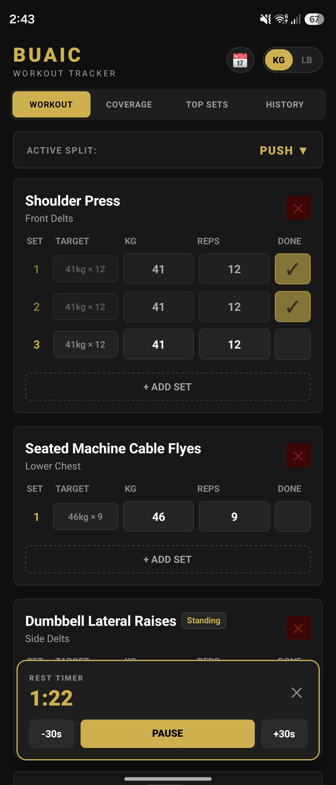
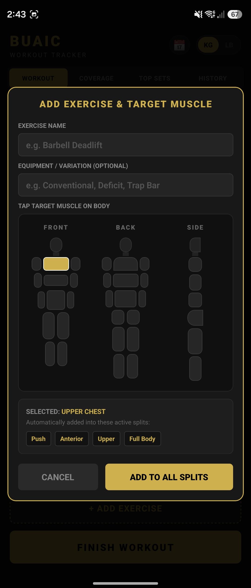
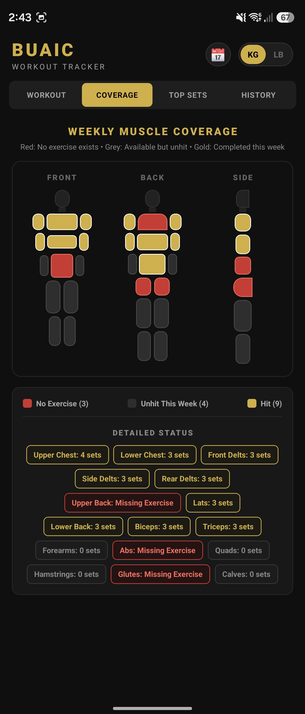
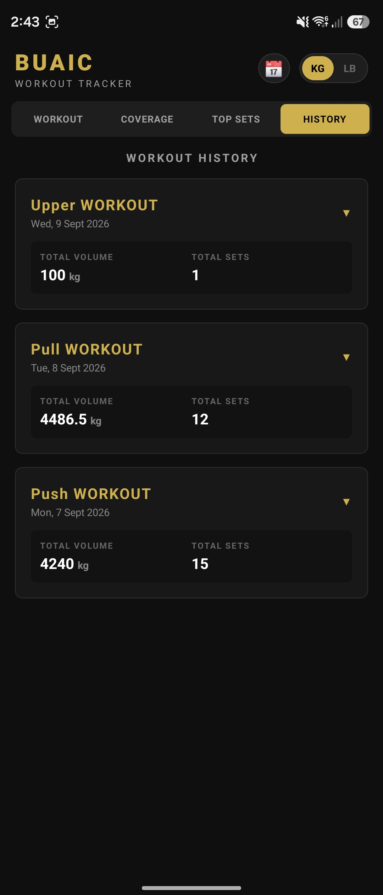
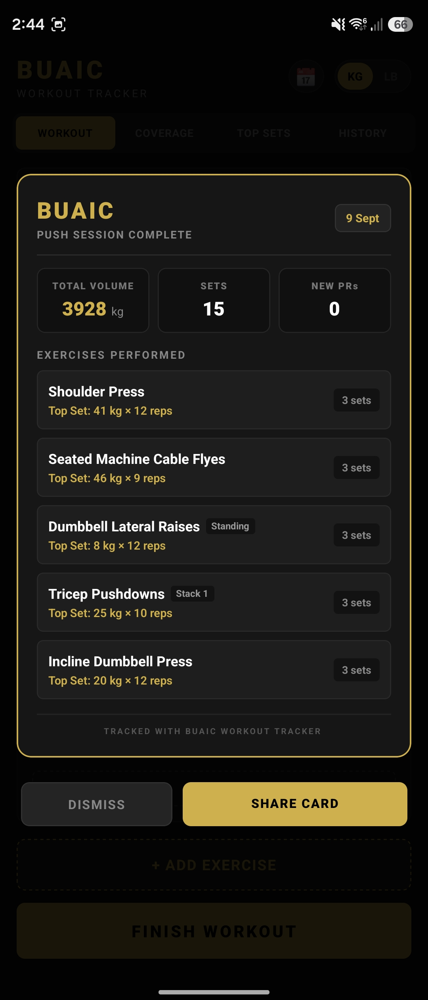

# Buaic — Minimalist Workout Tracker

An offline-first mobile workout tracker built with React Native, Expo, and SQLite. Engineered for zero latency in poor connectivity environments, featuring exact background hardware alarms, interactive 3-view anatomical muscle mapping, and shareable performance recap cards.

## App Interface

<p align="center">
  
  
  
  
  
</p>

<p align="center">
  <sub>Left to Right: Active Session & Standby Timer • Anatomical Muscle Mapping • 7-Day Volume Balance • Session History • Exportable Recap Card</sub>
</p>

---

## The Problem
Many modern fitness apps rely on cloud authentication, paywalls, or persistent internet connections—failing inside basements or shielded gym facilities where mobile reception is unreliable. Relying on simple notes apps requires manual set formatting, repetitive typing under fatigue, and manually switching to a separate clock app for rest intervals. 

**Buaic** addresses this by providing an offline-first, locally persisted tracking engine with automated split mapping and an integrated background-resilient rest timer.

---

## Technical Architecture

* **Offline-First Persistence (`expo-sqlite`)**: All workout splits, exercise definitions, set logs, and historical personal records (PRs) persist locally using relational schemas. Cascading foreign key constraints ensure database integrity when removing sessions or exercise variations.
* **Standby-Resilient Rest Timer**: Avoids standard JavaScript interval freeze when the device locks. Timer durations calculate against system epoch timestamps (`Date.now() + duration`). When the app foregrounds, an `AppState` listener reconciles elapsed time with zero drift.
* **Cross-Platform Exact Alarms**: Configured with `SCHEDULE_EXACT_ALARM` / `USE_EXACT_ALARM` permissions on Android to bypass OS Doze mode maintenance windows, using `exact: true` hardware alarm triggers alongside Apple `UserNotifications` framework guards on iOS.
* **Audio Session Management (`expo-av`)**: Explicitly configured to prevent audio ducking (`shouldDuckAndroid: false`, `playsInSilentModeIOS: true`), ensuring timer chimes sound without interrupting user media playback (Spotify/Apple Music).
* **Native Snapshot & Export (`react-native-view-shot`, `expo-sharing`)**: Renders off-screen UI components into PNG assets, triggering native share sheets for instant recap sharing.

---

## Key Features

- **Interactive 3-View Coverage Model**: Touch-driven anatomical silhouette (Front, Back, Side) tracking volume distribution across 16 muscle groups over a rolling 7-day window.
- **Dynamic Split Auto-Mapping**: Exercises link to anatomical muscle targets and automatically populate across all compatible routines (Push, Pull, Legs, Anterior, Posterior, Upper, Lower, Full Body).
- **Automated PR & 1RM Calculations**: Tracks all-time peak sets per exercise, pinning the Big 3 compound lifts (Bench Press, Squat, Deadlift) with estimated 1-Rep Max calculations using the Epley formula.
- **European Standard Activity Calendar**: Visualizes workout density on an MTWTFSS grid with distinct PR accomplishment badges.
- **Instant Unit Conversion**: Dynamic state toggle between Kilograms (kg) and Pounds (lb) with live input conversion.

---

## Tech Stack

* **Framework**: React Native (Expo)
* **Language**: JavaScript (ES6+)
* **Database**: `expo-sqlite`
* **Native APIs**: `expo-notifications`, `expo-av`, `expo-haptics`, `react-native-view-shot`, `expo-sharing`
* **Build Tooling**: Expo Prebuild, Android Gradle Plugin

---

## Running Locally

1. **Clone the repository**:
   ```bash
   git clone [https://github.com/nathan-doyle/Buaic-Workout-Tracker.git](https://github.com/nathan-doyle/Buaic-Workout-Tracker.git)
   cd Buaic-Workout-Tracker
   npm install
   npx expo start
   ```

2. **Install dependencies***:
   ```bash
   npm install
   ```

3. **Start the development server**:
   ```bash
   npx expo start
   ```

4. **Run on a device or emulator**:
   Scan the displayed QR code with the Expo Go app (Android) or Camera app (iOS).
   **Or** press a in the terminal to run directly on a connected Android device or emulator.
